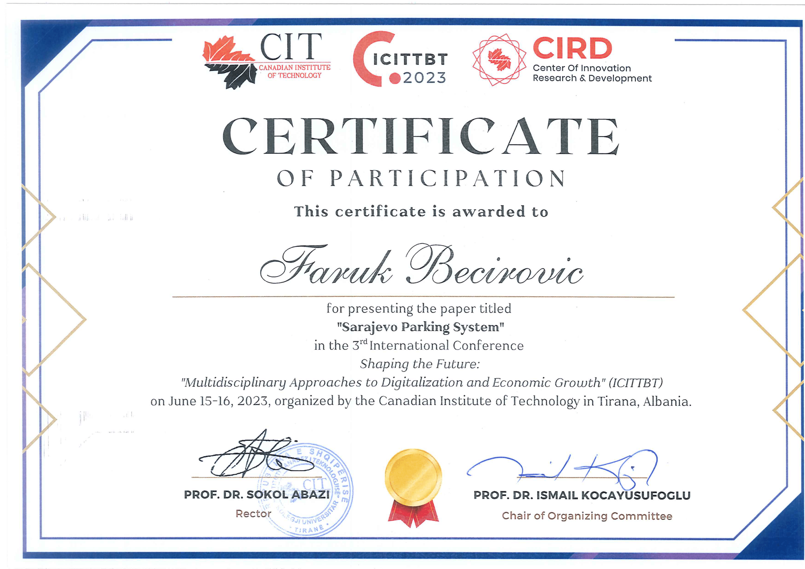

Faruk Becirovic has attended the 3rd ICITTBT conference oraganised by the Canadian Institute of Technology in Tirana, Albania. The  International Conference organized by CIT intends to create long-term strategic connections and foster interdisciplinary research among academic and industrial participants. The carefully selected conference themes have been chosen to engender these in the fields of: *Information Technology, Engineering, Industry 4.0, Business, Economics and Finance, Applied Sciences and Social Sciences*.

Faruk had the honor to represent his colleagues and present their paper as a part of conference proceedings titeled Sarajevo Parking System: Real-Time Parking Management System.

